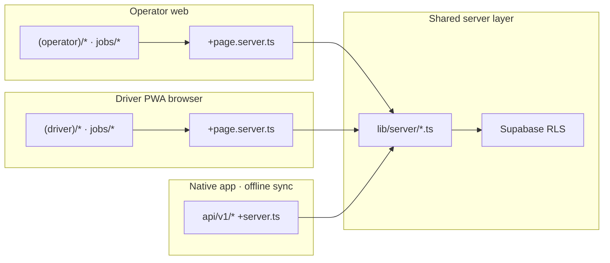

# Loadr Architecture — Hybrid API Model

Loadr uses a **hybrid data-access architecture**: SvelteKit web clients (operator and driver PWA) call `lib/server/*` directly from `+page.server.ts`. Clients that cannot run inside a page load — a future native app, or a service worker replaying queued offline actions — use versioned REST routes under `/api/v1/*`. Both paths share the same server modules and Supabase RLS.

**Rule:** API route handlers are thin wrappers — they parse the request, authenticate, call `lib/server/*`, and return spec-shaped JSON. **Never duplicate queries in `+server.ts`.**

Web pages **must not** import from `src/routes/api/v1/*`.

## Data flow



| Client | Data path | Auth |
|--------|-----------|------|
| Operator web | `+page.server.ts` → `lib/server/*` | Cookie session via `@supabase/ssr` in `hooks.server.ts` |
| Driver PWA (browser) | `+page.server.ts` → `lib/server/*` | Cookie session (same as operator) |
| Web login/signup | `(auth)/` pages + form actions | Cookies (unchanged) |
| Native mobile app | `fetch('/api/v1/...')` | Bearer JWT (`Authorization` header) |
| Offline sync replay | `fetch('/api/v1/...')` from service worker | **Cookie session** (same Supabase auth cookies as the driver PWA) |

### When to use `/api/v1/*`

Use the REST API only when the caller **cannot** use `+page.server.ts`:

- A future **native** iOS/Android app (no SvelteKit page rendering)
- **Service worker** replay of queued offline mutations after connectivity returns
- **Webhooks** and other server-to-server calls (e.g. Stripe)

Do **not** route the driver PWA's normal page loads, form actions, or job flows through the API. The driver app is a browser-rendered SvelteKit app; it already has `+page.server.ts` on the shared `jobs/` tree — same pattern as operator.

### Offline sync replay

When the driver PWA queues actions offline (start job, complete with photo, report issue), the service worker replays them against `/api/v1/*` using the browser's existing cookie session — no separate JWT flow.

| Queued action | Replay endpoint |
|---------------|-----------------|
| Start job | `PATCH /api/v1/jobs/:id` with `{ "status": "in_progress" }` |
| Complete job (with photo) | `POST /api/v1/jobs/:id/pod` (`multipart/form-data`) |
| Report issue | `POST /api/v1/jobs/:id/report-issue` (`multipart/form-data`) |

Job API routes use `requireApiJobsAccess()` in `lib/server/auth.ts`, which returns spec-shaped `401 UNAUTHORISED` JSON when the session is missing or expired — never an HTML redirect. The offline client must surface a clear failure state (e.g. "Please log in again to sync your updates") when replay receives `401`.

Drivers cannot set `status: "attempted"` via PATCH; that transition goes through `reportJobIssue()` only.

### Auth: one profile shape, two entry points

Cookie sessions (web) and Bearer JWT (native API) must resolve to the **same** `UserProfile` before any call into `lib/server/*`. Both paths go through a single resolution choke point (`resolveApiProfile` / `requireBearerOrCookie` in `lib/server/api/auth.ts` today; consolidate as this is built out). If cookie and JWT paths return different field sets, role-branching in `jobs.ts` will diverge between web and mobile without obvious symptoms.

| Auth surface | Used by | Notes |
|--------------|---------|-------|
| Cookie session | Operator web, driver PWA, `(auth)/` pages | Set in `hooks.server.ts` → `event.locals.profile` |
| Bearer JWT | Native mobile API clients | Returns JWT per API spec; stub today |
| `/api/v1/auth/*` | **Native mobile only** | Signup, login, activate, password reset for non-browser clients |

Web auth stays in `(auth)/` pages. Driver activation stays in `(driver)/activate` as a **form action** in `+page.server.ts` (cookie session established server-side). An SMS link such as `/activate?token=xyz` is still a normal page load — no separate API call required.

## Server modules (`src/lib/server/`)

| Module | API group | Public API routes |
|--------|-----------|-------------------|
| `jobs.ts` | 4 Jobs | Yes |
| `issues.ts` | 4 Jobs (report issue) | Yes |
| `users.ts` | 3 Users | Yes |
| `companies.ts` | 2 Companies | Yes |
| `pod.ts` | 5 Proof of Delivery | Yes |
| `vehicles.ts` | 8 Vehicles | Yes |
| `subscriptions.ts` | 9 Subscriptions | Yes |
| `notifications.ts` | 10 Notifications | Yes |
| `route-data.ts` | 7 Route Data | **No** — server-only |
| `blockchain.ts` | 11 Blockchain | **No** — server-only (wraps `solana.ts`) |
| `auth.ts` | Guards | — |
| `api/errors.ts`, `api/response.ts`, `api/auth.ts` | Shared API helpers | — |

Groups **7 (Route Data)** and **11 (Blockchain)** have no public `/api/v1` routes; they are invoked only from server code (page loads, jobs flow, etc.).

## Endpoint mapping

Routes below exist for native/offline clients. Web pages call the `lib/server` module directly instead.

| Spec endpoint | Route file | `lib/server` module |
|---------------|------------|---------------------|
| `POST /v1/auth/signup` | `api/v1/auth/signup/+server.ts` | — (native auth) |
| `POST /v1/auth/login` | `api/v1/auth/login/+server.ts` | — |
| `POST /v1/auth/logout` | `api/v1/auth/logout/+server.ts` | — |
| `POST /v1/auth/activate` | `api/v1/auth/activate/+server.ts` | — (native only; web uses form action) |
| `POST /v1/auth/forgot-password` | `api/v1/auth/forgot-password/+server.ts` | — |
| `POST /v1/auth/reset-password` | `api/v1/auth/reset-password/+server.ts` | — |
| `GET/PATCH /v1/companies/me` | `api/v1/companies/me/+server.ts` | `companies.ts` |
| `POST /v1/companies/me/logo` | `api/v1/companies/me/logo/+server.ts` | `companies.ts` |
| `GET/POST /v1/users` | `api/v1/users/+server.ts` | `users.ts` |
| `POST /v1/users/invite` | `api/v1/users/invite/+server.ts` | `users.ts` |
| `GET/DELETE /v1/users/:id` | `api/v1/users/[id]/+server.ts` | `users.ts` |
| `POST /v1/users/:id/resend-invite` | `api/v1/users/[id]/resend-invite/+server.ts` | `users.ts` |
| `GET/POST /v1/jobs` | `api/v1/jobs/+server.ts` | `jobs.ts` |
| `GET/PATCH/DELETE /v1/jobs/:id` | `api/v1/jobs/[id]/+server.ts` | `jobs.ts` |
| `POST /v1/jobs/:id/report-issue` | `api/v1/jobs/[id]/report-issue/+server.ts` | `issues.ts` |
| `GET/POST /v1/jobs/:id/pod` | `api/v1/jobs/[id]/pod/+server.ts` | `pod.ts` |
| `GET /v1/jobs/:id/history` | `api/v1/jobs/[id]/history/+server.ts` | `jobs.ts` |
| `GET /v1/jobs/:id/pod/download` | `api/v1/jobs/[id]/pod/download/+server.ts` | `pod.ts` |
| `GET/POST /v1/vehicles` | `api/v1/vehicles/+server.ts` | `vehicles.ts` |
| `DELETE /v1/vehicles/:id` | `api/v1/vehicles/[id]/+server.ts` | `vehicles.ts` |
| `GET /v1/subscriptions/me` | `api/v1/subscriptions/me/+server.ts` | `subscriptions.ts` |
| `POST /v1/subscriptions/checkout` | `api/v1/subscriptions/checkout/+server.ts` | `subscriptions.ts` |
| `POST /v1/subscriptions/portal` | `api/v1/subscriptions/portal/+server.ts` | `subscriptions.ts` |
| `POST /v1/subscriptions/webhook` | `api/v1/subscriptions/webhook/+server.ts` | `subscriptions.ts` |
| `GET /v1/notifications` | `api/v1/notifications/+server.ts` | `notifications.ts` |
| `PATCH /v1/notifications/:id/read` | `api/v1/notifications/[id]/read/+server.ts` | `notifications.ts` |
| `PATCH /v1/notifications/read-all` | `api/v1/notifications/read-all/+server.ts` | `notifications.ts` |

## Web page → server module (intended)

| Web route | Server calls |
|-----------|--------------|
| `jobs/+page.server.ts` | `listJobsForUser()` — operator and driver |
| `jobs/[id]/+page.server.ts` | `getJobForUser()` + `startJobForDriver()` form action (driver) |
| `jobs/[id]/complete/+page.server.ts` | `getJobForUser()` + `uploadPodForJob()` form action |
| `jobs/[id]/report-issue/+page.server.ts` | `getJobForUser()` + `reportJobIssue()` form action |
| `(operator)/drivers/+page.server.ts` | `users.ts` list (when built) |
| `(operator)/settings/+page.server.ts` | `companies.ts`, `subscriptions.ts` |
| `(driver)/activate/+page.server.ts` | Form action → activation logic (cookie session); **not** `/api/v1/auth/activate` |

## Error responses

`/api/v1/*` endpoints use the spec error shape defined in `src/lib/types/api.ts` and helpers in `src/lib/server/api/errors.ts` and `response.ts`:

```json
{
  "error": {
    "code": "UNAUTHORISED",
    "message": "…",
    "status": 401
  }
}
```
